# PilingTrack — Бриф для дизайнера

## 1. Что за продукт

**PilingTrack** — веб-приложение для учёта свайных и буровых работ на стройплощадках. Используется внутри одной строительной организации.

**Аудитория и сценарии:**

| Роль | Где работает | Главные задачи |
|---|---|---|
| **Оператор** (свайщик) | Смартфон на объекте, перчатки, грязь, солнце/мороз | Заполнить отчёт за смену: сваи, бурение, простои. 1–2 раза в день, 2–5 минут. |
| **Помощник оператора** | То же | То же, иногда от имени оператора. |
| **Диспетчер** | Десктоп в офисе | Контроль ежедневных отчётов, корректировки, выгрузка PDF. |
| **Администратор** | Десктоп | Объекты, бригады, справочники, пользователи, аналитика. |

**Ключевые цифры в данных:** количество свай (шт), метры свай и бурения (м.п.), часы простоя (ч), даты, оператор, объект.

## 2. Технологический контекст (для дизайнера это ограничения)

- **Веб-приложение, адаптивное.** На мобильных у операторов работает как PWA («добавить на главный экран»). На десктопах у админов — обычный браузер.
- **Стек:** Next.js, Tailwind CSS, shadcn/ui (Radix). У нас уже есть готовая библиотека компонентов: Button, Card, Dialog, Sheet, Select, Input, Skeleton, Badge, Progress, Toast, Sidebar, и др. Дизайнер должен работать **поверх** этой библиотеки, не изобретая базу.
- **Шрифты сейчас:** Inter (UI) + JetBrains Mono (для цифр в данных).
- **Цветовая система:** OKLCH-токены в `globals.css` (есть light + dark темы, но пользоваться dark пока не пользуемся).
- **Иконки:** lucide-react.
- **Анимации:** framer-motion — лёгкие, не отвлекающие (вход карточки, переход между экранами).

## 3. Что не так сейчас

Честная самооценка после ревью кодовой базы:

1. **Цветовая идентичность размыта.** Оранжевый используется одновременно как brand-color, как primary action, как декорация заголовков, как бейдж активности — теряется акцент.
2. **Иерархия на админ-дашборде слабая.** 4 карточки KPI одинакового цвета и размера → нет «главного числа». Прораб не понимает, на что смотреть в первую очередь.
3. **Зоопарк размеров шрифта.** В коде встречаются `text-[10px]`, `text-[11px]` рядом с обычными `text-xs` / `text-sm` — нет дисциплины.
4. **Декоративные иконки шумят.** Иконка дублирует соседний текст («📊 Аналитика», «📁 Объекты»).
5. **Информационная плотность не сбалансирована.** На больших мониторах (1920+) контент остаётся узким, пустые поля по бокам. На мобильных же местами тесно.
6. **Состояния «пусто» / «загрузка» / «ошибка» не до конца проработаны** — есть скелетоны, но empty-states выглядят бедно.
7. **Тёмная тема объявлена технически, но не доведена до ума** — переменные определены, тумблера нет, многие компоненты содержат сырые литералы (`bg-white`, `text-slate-900`), которые не переключатся.
8. **Операторский экран (мобильный) хорош** — Hero-CTA в полстраницы, цвет меняется по состоянию смены. Это можно взять за образец иерархии для остальных экранов.

## 4. Что нужно от дизайнера

### A. Дизайн-система (главное)

Хочется получить артефакты, по которым можно собрать строгую систему в коде. Без этого визуальная разнобоистость будет повторяться.

**Минимально:**

1. **Цветовая палитра** в OKLCH или HEX:
   - **Brand / Primary action** — один акцент (сейчас оранжевый, можно оставить или сменить).
   - **Neutral scale** — 9–11 ступеней серого (для фона, текста, границ, разделителей).
   - **Status colors** — успех / предупреждение / ошибка / информация. С версиями для текста, фона и бордера.
   - **Data colors** — 3–5 цветов для графиков (recharts). Они должны различимо читаться и не конфликтовать с brand.
   - Версии для **тёмной темы** (если будем делать).

2. **Типографическая шкала** — фиксированный набор размеров и весов:
   - Page title (H1)
   - Section title (H2)
   - Card title (H3)
   - Body (default)
   - Caption / metadata
   - Display number (для больших KPI-цифр на дашборде)
   - Data number (для табличных значений: моноширинный, tabular-nums)
   
   На каждый — `font-size`, `line-height`, `font-weight`. Желательно по шкале (12/14/16/18/24/30/48/72), а не «на глаз».

3. **Spacing scale** — кратная 4px шкала, как Tailwind делает по умолчанию (4/8/12/16/24/32/48/64). Но определить **где какое расстояние использовать** (gap внутри карточки, между карточками, секциями).

4. **Радиусы и тени:**
   - Сколько уровней `border-radius` (например, `sm`/`md`/`lg`/`xl`/`full`) и где какой применяется.
   - 2–3 уровня теней (карточка, поднятая карточка, dropdown). Не нужен набор из 10 теней.

5. **Иконография:**
   - Подтвердить lucide-react или предложить замену (один набор, не смесь).
   - Когда иконка обязательна, когда декоративная (правило: не дублирует текст рядом).

### B. Шаблоны экранов (mockups)

Не все экраны, а ключевые **состояния** + образцы для остальных:

1. **Операторский дашборд** (мобильный) — главная страница оператора.
2. **Форма отчёта** (мобильный) — сложная многосекционная форма (сваи / бурение / простои).
3. **Админ-дашборд** (десктоп + мобильный) — с правильной иерархией KPI.
4. **Список объектов** (десктоп + мобильный) — с раскрывающейся иерархией: объект → поле → куст → пикет.
5. **Список отчётов** (десктоп) — фильтры + список + детальный диалог.
6. **Аналитика** (десктоп) — 2 вкладки: операторы (топ + таблица + бар-чарт), тренды (line-chart по неделям).
7. **Шаблон диалога / модалки** — на нём видно как выглядят формы, ошибки, кнопки.
8. **Шаблон пустого состояния, загрузки, ошибки** — три состояния каждой страницы.

### C. Конкретные UX-улучшения, которых хочется

Помимо стилей, два смысловых момента:

1. **Иерархия KPI на дашборде.** Сейчас «всё одинаково». Хочется: **один главный показатель сверху** (например, % выполнения плана) + 3 второстепенных. Дизайнер решает, как этого добиться визуально.
2. **Группировка навигации.** В админке 8 пунктов в плоском меню. Логически они делятся: «Производство» (объекты, установки, бригады, отчёты, аналитика), «Конфигурация» (справочники, пользователи, telegram), «Эксплуатация» (DLQ, мониторинг). Хочется визуальной группировки.

## 5. Что мне нужно от дизайнера на выходе (артефакты)

Чтобы я мог собрать это в коде без догадок:

| Артефакт | Формат | Зачем |
|---|---|---|
| **Дизайн-токены** | Figma Variables / JSON / Markdown с CSS-переменными | Единый источник правды для цветов, шрифтов, радиусов, отступов. Я подставлю их в `globals.css`. |
| **Шкала шрифтов** в виде таблицы | Markdown / Figma | Размер + line-height + weight + use-case на каждую ступень. |
| **Mockups ключевых экранов** | Figma | По одному на каждое состояние (default / empty / loading / error). Mobile + desktop где применимо. |
| **Спецификация компонентов** | Figma + 1–2 строки текста на каждый | Button, Card, Dialog, Input, Select, Badge, Progress, Tabs — что есть в shadcn/ui, и что меняем относительно дефолта. |
| **Гайд по микро-паттернам** | Markdown / Figma frame | Как выглядит «KPI-карточка», «list item», «filter bar», «data table». |
| **Цвета для recharts** | список из 3–5 hex/oklch | Чтобы графики не выпадали из палитры. |

## 6. Что НЕ нужно от дизайнера

- Перерисовывать shadcn/ui компоненты с нуля. Использовать как есть, переопределять через токены.
- Делать иллюстрации, маскотов, лендинг-страницы. Это внутренний инструмент.
- Прорабатывать onboarding / тур по приложению.
- Делать иконку приложения и splash-screens (есть отдельно).

## 7. Стиль, которого хочется

Несколько референсов **тона**, не для копирования:

- **Linear, Notion, Vercel dashboard** — спокойная нейтральная база, единственный яркий акцент, плотные но читаемые таблицы.
- **Stripe Dashboard** — отличный пример работы с числовыми KPI и таблицами.
- **Apple HIG** — иерархия типографики (главное — большое и редкое, остальное — мелкое и повторяющееся).

**Чего точно не хочется:**

- «Декоративных» градиентов и стеклянных эффектов везде.
- Иконок вместо текста (мы не для дизайнеров пишем).
- Тёмных тем «на эффект» без дисциплины.

## 8. Контекст для понимания пользователя

Полезно знать:

- Оператор работает в перчатках, на холоде, на ярком солнце. Минимальный размер тапа (touch-target) — 44–48px. Контраст важнее, чем «воздушность».
- Часть отчётов вводится на ходу, поэтому форма должна позволять заполнить за минимум тапов. Сейчас три раздела (сваи / бурение / простои) — норма, но в отчёте может быть 5–10 строк свай разных марок.
- Админ часто открывает отчёт прораба прямо на встрече — нужен PDF одной кнопкой.
- В РФ-контексте: даты в формате `ДД.ММ.ГГГГ`, числа с пробелом-разделителем тысяч (`1 234`), запятая как десятичный разделитель.

---

## 9. Текущее состояние экранов («больные места»)

Скриншоты лежат в `docs/design-brief-screenshots/`. Под каждым — конкретные замечания и зачем мы вообще про это говорим.

### Админ (десктоп, 1920×1080)

#### 9.1 Дашборд — `admin-desktop-01-dashboard.png`

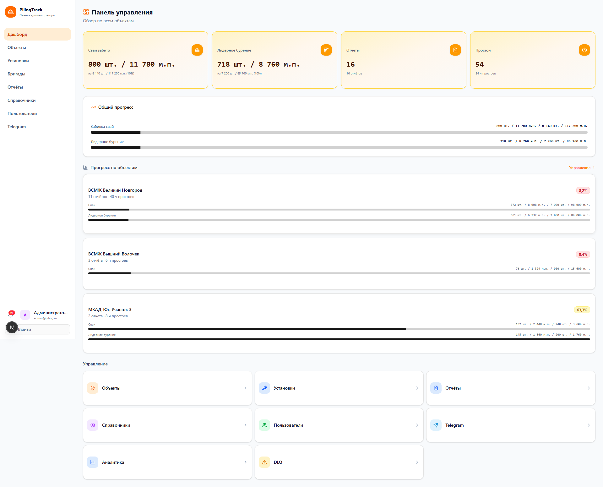

- **4 KPI-карточки одного цвета и веса** (амбер-градиент). У всего равный визуальный вес → нет иерархии. Прораб не понимает, на что смотреть в первую очередь.
- **Quick-links снизу — 8 одинаковых плиток** (Объекты, Установки, Отчёты, Справочники, Пользователи, Telegram, Аналитика, DLQ). Это плоское меню, а не «быстрый доступ».
- На 1920px **контент остаётся узким**, по бокам пустые поля.
- В шапке `<LayoutDashboard/>` иконка дублирует слово «Панель управления».

**Что хочется:** один большой KPI сверху (% выполнения плана), три вторичных, группировка нижних плиток по доменам (Производство / Конфигурация / Эксплуатация).

#### 9.2 Объекты — `admin-desktop-02-sites.png`

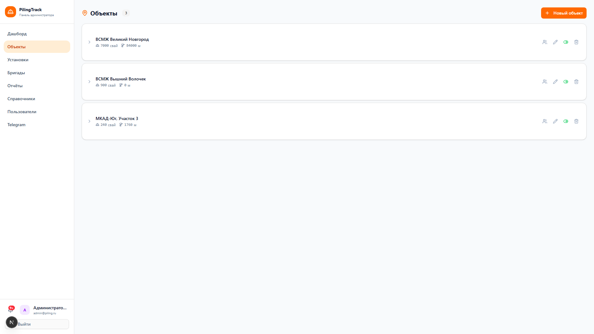

- В заголовке оранжевая иконка `<MapPin/>` + бейдж со счётчиком — оранжевый используется как декорация, а кнопка справа «Новый объект» (тоже оранжевая) — как primary action. Цвет теряет акцентную роль.
- Список объектов — это аккордеон (раскрывается иерархия поле → куст → пикет). В свёрнутом состоянии каждая строка содержит много мелких бейджей (`text-[10px]`), которые слипаются.
- Прогресс-бары по объектам — тонкие (1.5px), при беглом взгляде нечитаемы.

**Что хочется:** правила вёрстки списочного элемента — что показываем в свёрнутом виде, что в раскрытом, какие бейджи допустимы.

#### 9.3 Установки — `admin-desktop-03-equipment.png`

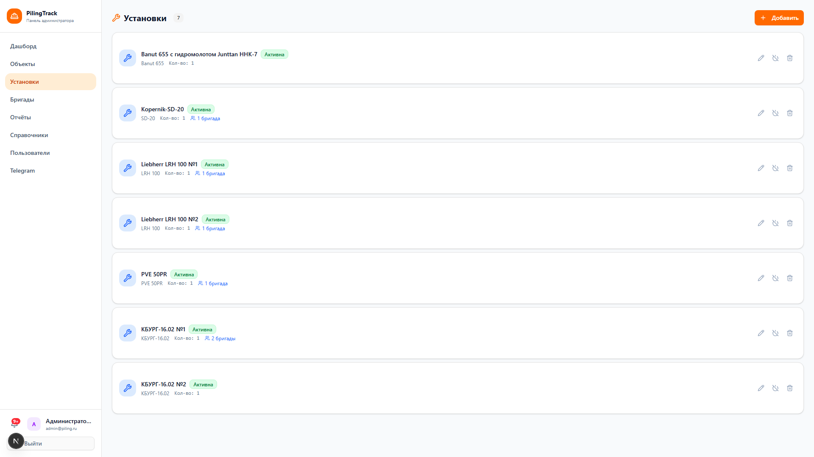

- То же что в «Объектах»: оранжевая `<Wrench/>` + `Badge` со счётчиком + оранжевая кнопка → конкуренция оранжевых.
- Отсутствует контекст: непонятно, какие установки в работе, какие свободны, у каких есть бригада.

**Что хочется:** статус-семантика (в работе / свободна / в ремонте) и связанная с ней цветовая семафорная палитра.

#### 9.4 Отчёты — `admin-desktop-04-reports.png`

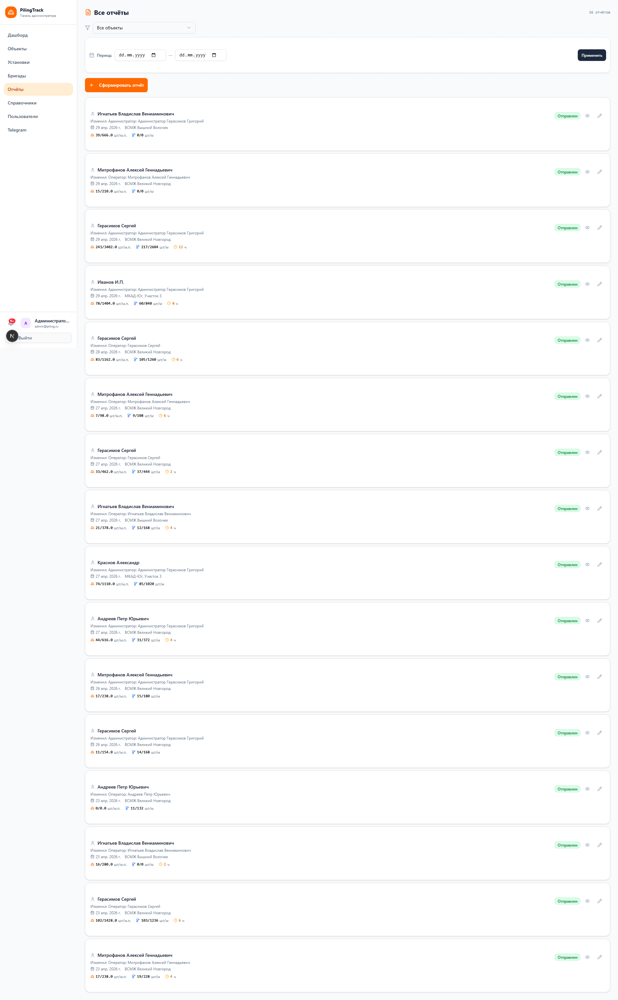

- Самая плотная страница: фильтры + большая кнопка «Сформировать отчёт» + длинный список карточек.
- Каждая карточка отчёта содержит дату, объект, оператора, кучу мелких чисел и три кнопки действий — плотность правильная, но **типографика плывёт** (`text-xs` рядом с `text-[10px]`).
- При активном фильтре периода открывается «period-summary» (см. отдельный скриншот в PDF выше) — тоже четыре одинаковых карточки.

**Что хочется:** шаблон карточки отчёта со строгой иерархией (дата + объект — крупно; цифры — моноширинные; действия — справа, серые).

#### 9.5 Аналитика → Операторы — `admin-desktop-05-analytics-operators.png`

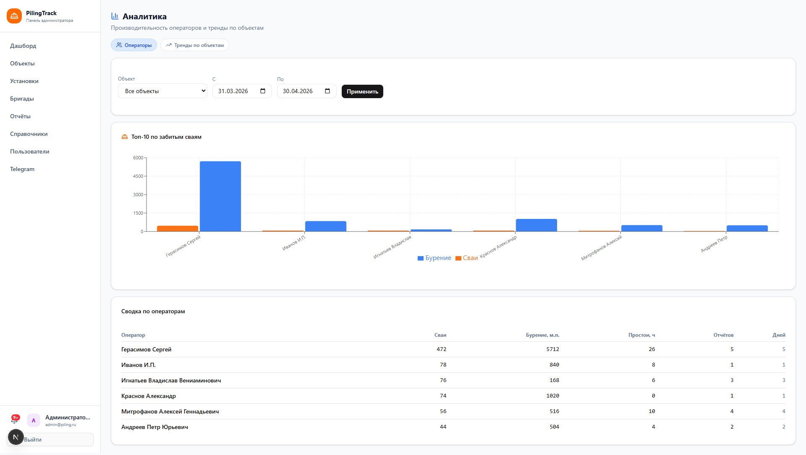

- Вкладки сверху используют **синий цвет** (отличие от brand-оранжевого) — это пример, как уживаются разные семантические цвета.
- Бар-чарт + таблица с моноширинными цифрами — нормально, но **чарт без подписей осей и без totals-строки в таблице**.
- Между фильтрами и графиком нет визуальной группировки — всё одного уровня.

#### 9.6 Справочники — `admin-desktop-07-dictionaries.png`

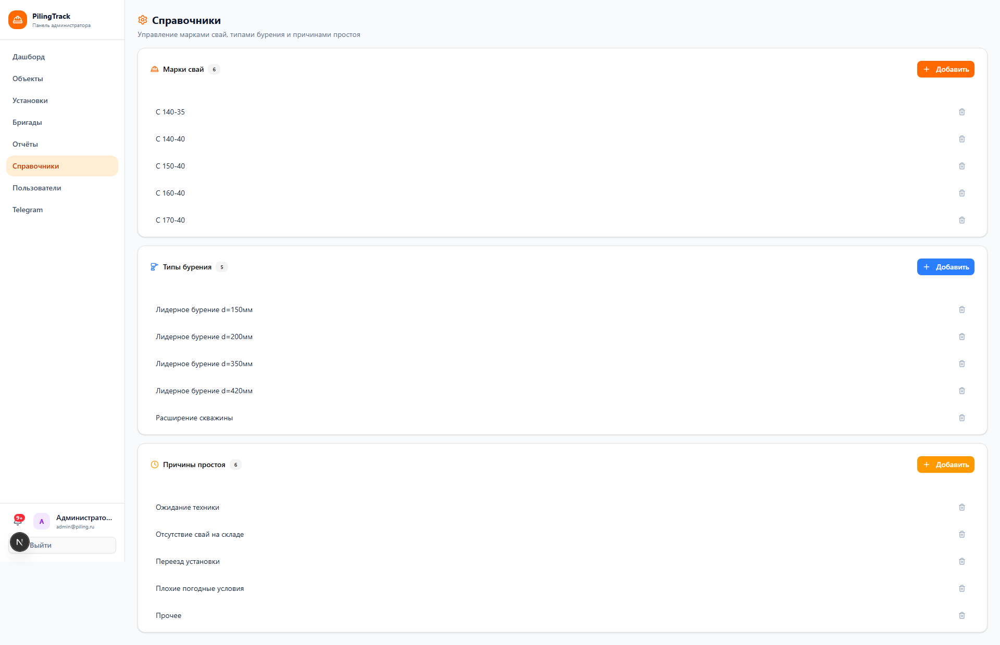

- Простой CRUD-экран, но с табами (марки свай / типы бурения / причины простоев).
- Бейджи активности тоже `text-[10px]` — слипаются.

**Что хочется:** шаблон CRUD-страницы со словарём (заголовок, табы, кнопка «Добавить», таблица).

#### 9.7 Пользователи — `admin-desktop-08-users.png`

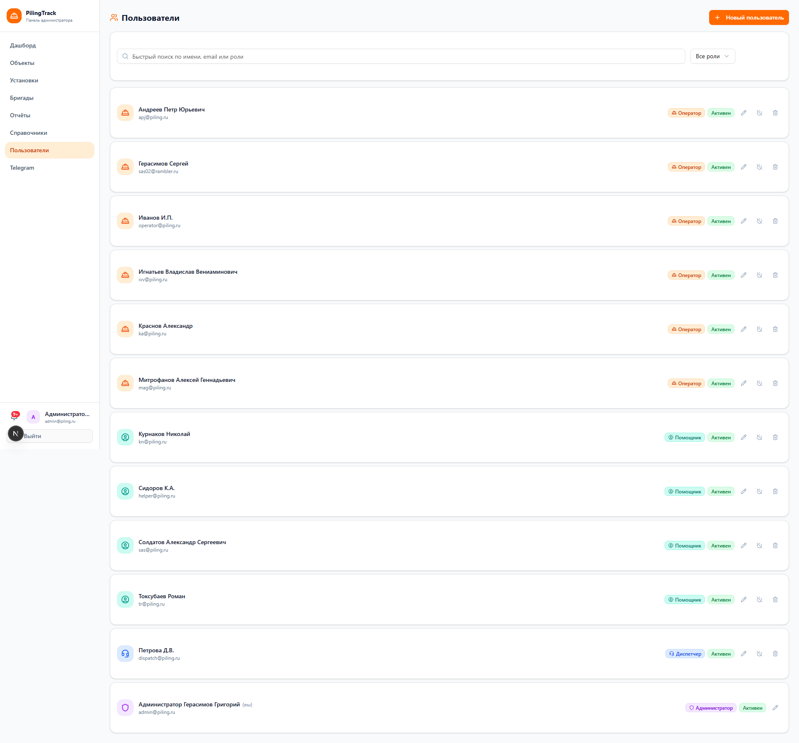

- Аватар через инициалы в кружке `bg-purple-100 text-purple-600` — этот сиреневый больше нигде не используется. Случайный цвет.
- Роли (Админ / Диспетчер / Оператор / Помощник) показаны текстом, без визуальной кодировки.

**Что хочется:** цветовая кодировка ролей в едином стиле, нормальная аватарка.

#### 9.8 Telegram — `admin-desktop-09-telegram.png`

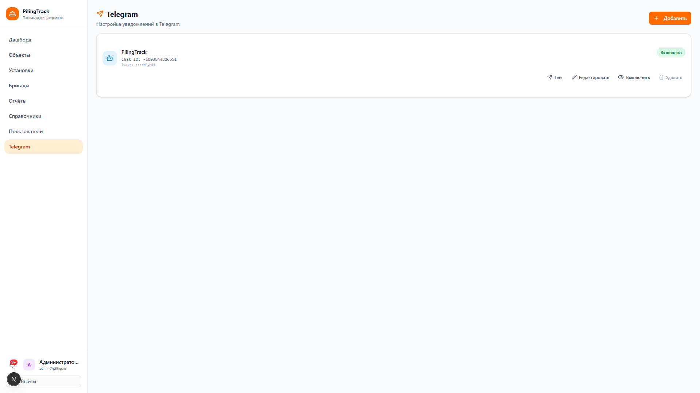

- Форма с зашифрованным токеном (показываем `***` или `enc:`). Кнопка «Тест» рядом с настройками — ок.
- На странице нет наглядного индикатора «бот подключён / нет»: пользователь не понимает, всё ли работает.

**Что хочется:** статусный блок «подключение OK / ошибка / не настроено» с иконкой и подсказкой.

#### 9.9 DLQ — `admin-desktop-10-dlq.png`

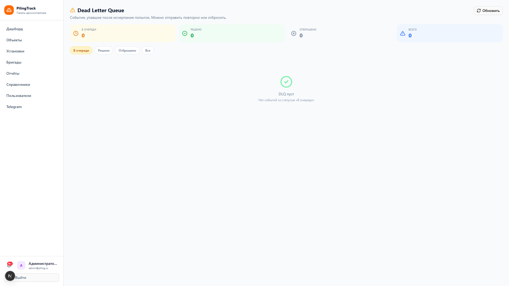

- Это страница для редких аварий (упавшие события). 95% времени должна быть пустой.
- Текущая пустая версия выглядит почти как «тут ничего нет, что-то сломано». Хочется наоборот — «всё хорошо, упавших событий 0».

**Что хочется:** позитивное empty-state с подсказкой, что DLQ пустой = система здорова.

#### 9.10 Бригады — `admin-desktop-11-crews.png`

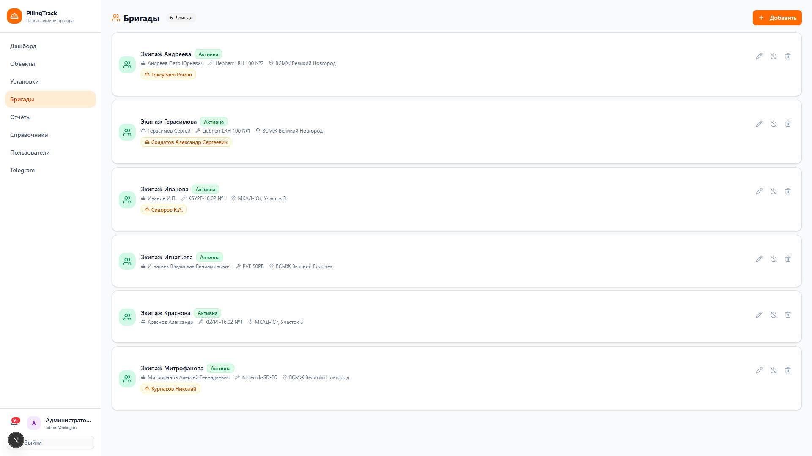

- Список бригад: оператор + помощник + объект + установка.
- Связи многие-ко-многим неочевидны на глаз — бригада это связка (оператор × установка × объект), и нужен компактный паттерн карточки для такой композитной сущности.

### Админ (мобильный, 390×844 — iPhone 16 Pro Max)

#### 9.11 Дашборд (мобильный) — `admin-mobile-01-dashboard.png`

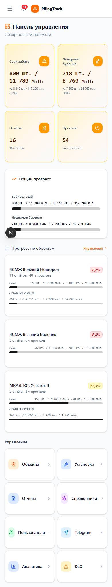

- Карточки складываются в 2 колонки, но всё равно перегружены текстом — `text-[10px]` подписи становятся почти нечитаемыми на ретине.
- Sidebar превратился в Sheet (бургер сверху-слева).

#### 9.12 Отчёты (мобильный) — `admin-mobile-02-reports.png`

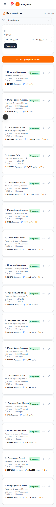

- Карточка отчёта переполнена: дата + объект + оператор + числа + 3 кнопки в одну строку.
- Кнопки 32px — мелковато для тапа в перчатках.

**Что хочется:** mobile-специфичная карточка отчёта — основная инфа крупно, действия в свайпе или меню «···».

### Оператор (мобильный — основной сценарий)

#### 9.13 Главная оператора — `operator-mobile-01-dashboard.png`

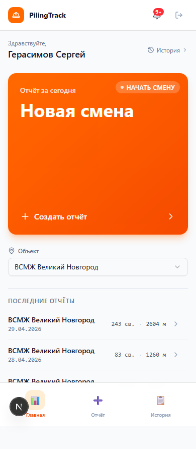

- **Это самый удачный экран в приложении.** Hero-CTA на полстраницы, цвет меняется по состоянию (оранжевый «Начать смену» → зелёный «Смена идёт» → серый «Заблокировано»), огромное число свай за день.
- Bottom-nav снизу с тремя пунктами и эмодзи (📊 ➕ 📋) — спорно (эмодзи рендерятся по-разному на разных iOS), но рабочий.

**Что хочется:** взять иерархию этого экрана за **образец** для админ-дашборда. Заменить эмодзи на нормальные lucide-иконки.

#### 9.14 Форма отчёта — `operator-mobile-02-report-form.png`

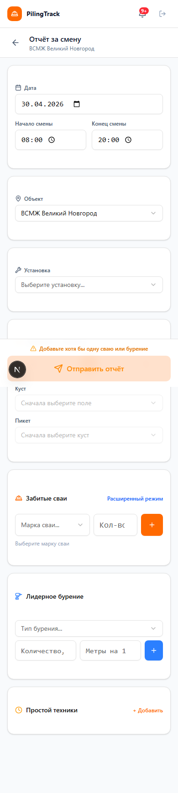

- Самая сложная форма: смена + объект + установка + каскад поле/куст/пикет + сваи + бурение + простои.
- Сейчас всё в одну простыню, секции разделены только заголовками. Длина прокрутки высокая.

**Что хочется:** аккордеон или степпер для секций, чтобы сократить прокрутку и явно показать прогресс заполнения.

#### 9.15 История — `operator-mobile-03-history.png`

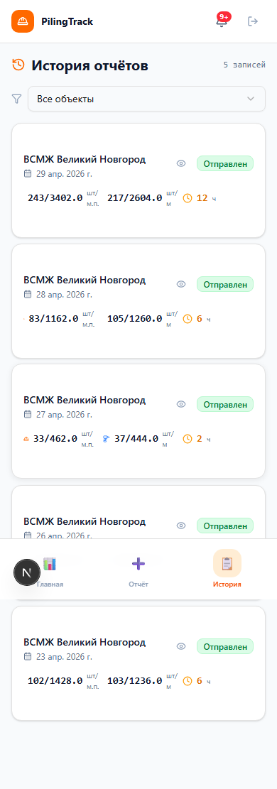

- Список собственных отчётов оператора. Просто, читаемо, ничего не плывёт. Хороший пример «спокойного» экрана.

### Оператор (десктоп — нетипично, но бывает)

#### 9.16 Главная оператора, десктоп — `operator-desktop-01-dashboard.png`

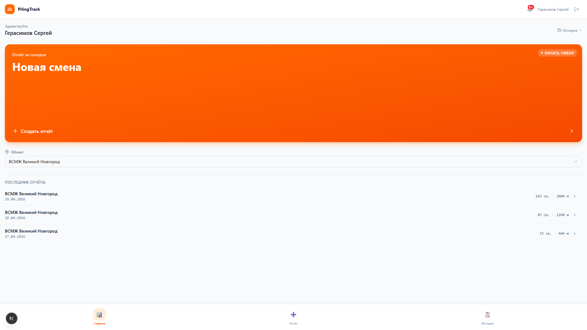

- Когда оператор открывает приложение в браузере на ноуте — Hero-CTA растягивается на всю ширину и выглядит очень ярко. Нужно решить: ограничивать ширину для оператора или нет.

#### 9.17 Форма отчёта, десктоп — `operator-desktop-02-report-form.png`

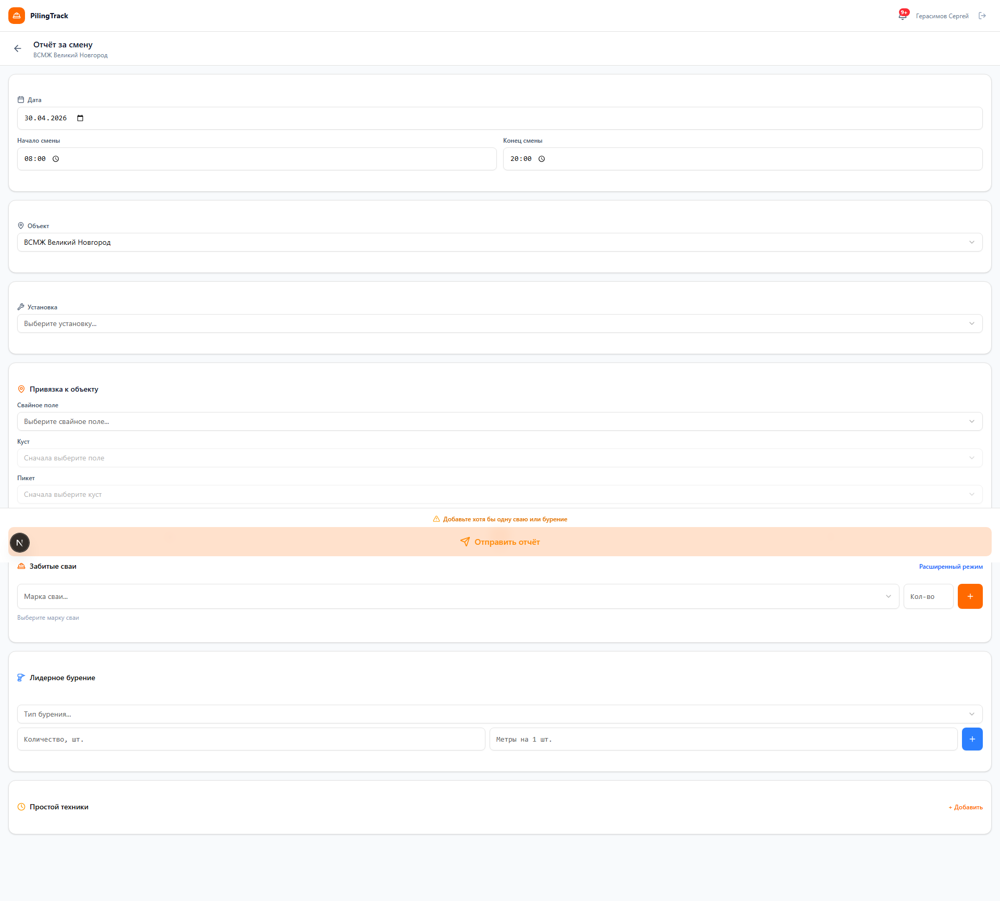

- Та же форма на десктопе. Видно много пустого пространства — на 1920px это смотрится грустно. Можно сделать двухколоночный layout (Сваи слева, Бурение справа, Простои снизу).

---

### Сводный список «что точно надо починить»

Если выделить **5 паттернов**, которые повторяются на большинстве экранов:

1. **Иконка + текст в заголовке** (`<MapPin/> Объекты`, `<Wrench/> Установки`) — иконка дублирует слово, надо убирать.
2. **Bейдж со счётчиком в шапке** (`<Badge>{count}</Badge>`) — нелогично рядом с кнопкой действия. Перенести в подзаголовок или KPI.
3. **`text-[10px]` / `text-[11px]` подписи** — везде. Заменить на единую шкалу.
4. **Оранжевый везде** (иконки + бейджи + кнопки + прогресс) — выбрать одно применение, остальное в нейтрал.
5. **4 равноправные KPI-карточки** на дашбордах — заменить на 1 hero + 3 secondary.

Эти 5 паттернов покрывают примерно 70% визуального шума.

---

Если что-то непонятно — спрашивайте. Лучше потратить день на согласование, чем неделю на переделку.
