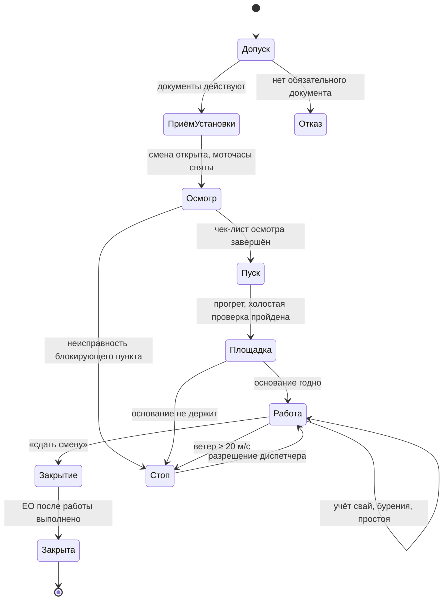
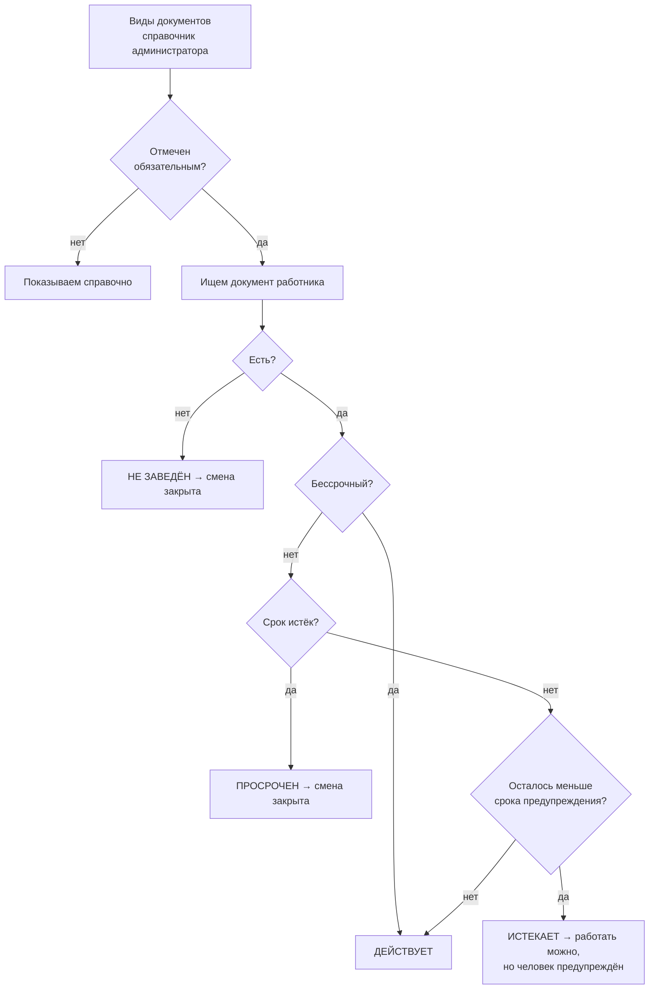
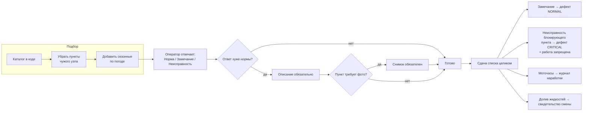
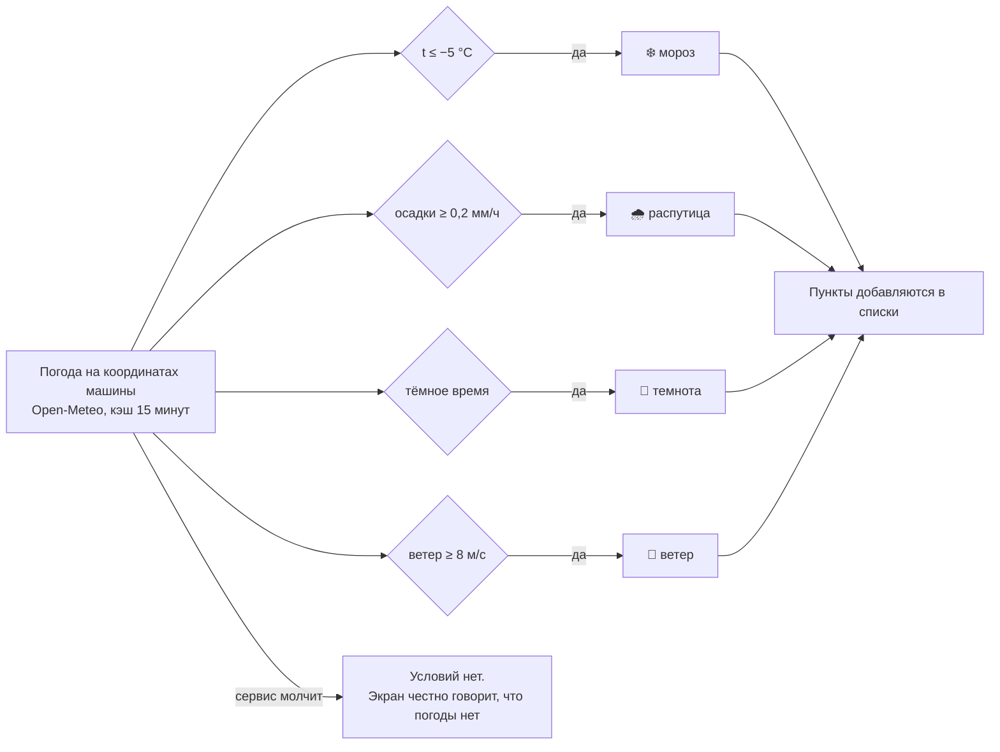
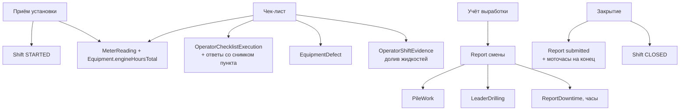

# Мобильный модуль машиниста

Рабочее место машиниста сваебойной установки на телефоне: от проверки допуска
утром до сдачи смены вечером. Собран с нуля, живёт отдельно от `/operator/v2…v5`
и ничего из них не использует.

- Маршрут: `/operator/mobile`
- API: `GET /api/operator/mobile/state`, `POST /api/operator/mobile/command`
- Домен: `src/modules/operator-mobile/`
- Экраны: `src/components/piling/operator-mobile/`
- Режим: **только онлайн**. Автономной очереди нет.

---

## 1. Три решения, на которых стоит модуль

**Фаза смены вычисляется, а не хранится.** Нет поля «текущий шаг». Экран
выводится из записанных фактов: есть ли действующие документы, принята ли
машина, какие чек-листы завершены, сдана ли смена. Хранимая фаза — это второй
источник правды: чек-лист прошёл, а поле не обновилось из-за оборванного
запроса, и оператор заперт на экране, который уже сделал. Здесь такого состояния
нет: перезагрузил телефон — вернулся ровно туда, где остановился.

**Запреты считаются в одном месте.** Просроченная медсправка, трещина в мачте,
ветер 22 м/с, машина выведена из эксплуатации — разные по природе запреты, но
ответ на вопрос «можно работать?» один и тот же на всех экранах. Если каждый
экран решает сам, оператор в конце концов находит тот, который его пропускает.

**Состав чек-листа зависит от машины и погоды.** Базовый список короткий.
Зимние пункты появляются по факту мороза, пункты про распутицу — по факту
осадков, про освещение — в тёмное время, про молот — только если молот есть.
Список, где половина пунктов не к месту, перестают читать через неделю.

---

## 2. Ход смены

Порядок жёсткий, и это не бюрократия: это порядок, в котором отказы
обнаруживаются дёшево. Холодную течь видно на земле, а не на четвёртой свае.

| Фаза | Что происходит | Чем закрывается |
|---|---|---|
| Допуск оператора | Проверка удостоверения машиниста, медсправки, удостоверения по ОТ, инструктажа | Все обязательные документы действуют |
| Приём установки | Объект, машина, помощник, последние моточасы, свай забито ранее, погода | Введены моточасы по счётчику, смена открыта |
| Осмотр машины | Предсменный осмотр холодной машины | Чек-лист завершён, блокирующих неисправностей нет |
| Пуск и прогрев | ЕО перед работой: пуск, прогрев, холостая проверка, смазка | Чек-лист завершён, моточасы сняты |
| Площадка | Готовность основания и зоны работ | Чек-лист завершён |
| Работа | Учёт свай, лидерного бурения, простоя | Оператор нажал «сдать смену» |
| Закрытие смены | ЕО после работы, итог, что передать дальше | Смена закрыта, отчёт отправлен |

---

## 3. Откуда берётся допуск

Список обязательных документов ведёт администратор, а не программист: его состав
диктуют законодательство и заказчик, и он пополняется без выпуска новой версии.
Из нескольких документов одного вида действует **самый поздний** — иначе
продлённое удостоверение не спасало бы от отказа в допуске.

---

## 4. Как устроен чек-лист

**Три ответа, не четыре.** «Не применимо» в модуле нет. Пункты, которых на этой
машине или при этой погоде быть не должно, отсеиваются до показа. Кнопка
«неприменимо» на осмотре мачты — это способ не осматривать мачту.

**Сдача целиком, не по одному пункту.** Осмотр — это одно решение «машина
годна», а не двенадцать независимых. Половина пунктов «норма» не значит, что
вторая половина не остановит смену.

**Замечание становится дефектом.** Замечание, живущее только внутри чек-листа, —
это замечание, о котором механик не узнает. У дефекта появляется владелец и
срок. Ключ источника (`установка : этап : пункт`) устойчив: незакрытая течь на
следующей смене попадёт в тот же дефект, а не заведёт третью копию.

---

## 5. Чек-листы

Правило состава: пункт попадает в список, если его пропуск может убить человека,
остановить машину на сутки или сорвать сдачу работ. Всё остальное — руководство
по эксплуатации, а не чек-лист. Отсюда 6–12 пунктов на этап.

Отметка **⛔** — неисправность по этому пункту запрещает работу.
Отметка **📷** — при замечании и неисправности обязателен снимок.
Отметка **❄️ 🌧 🌙 💨** — пункт появляется только при морозе, осадках, в темноте,
при сильном ветре.

### 5.1. Предсменный осмотр — холодная машина, до пуска

| | Пункт | На что смотреть |
|---|---|---|
| 📷 | Стёкла кабины и зеркала целы, обзор чистый | Трещина в лобовом на морозе расходится за смену |
| ⛔📷 | Ходовая: гусеницы, натяжение, катки, звёздочки | Провисание, потеря пальцев, трещины на башмаках |
| ⛔📷 | Мачта и стрела: сварные швы, деформации, крепёж | Трещина в мачте — работа запрещена |
| ⛔📷 | Молот: крепление, корпус, рукава | только при наличии молота |
| ⛔📷 | Вращатель и буровой инструмент: крепление, замки | только при наличии вращателя |
| ⛔📷 | Тросы: обрывы прядей, износ, крепление коушей | Обрывы на длине одного шага свивки — под замену |
| | Двигатель: уровень масла | при замечании — сколько долито, л |
| | Двигатель: уровень охлаждающей жидкости | при замечании — сколько долито, л |
| ⛔📷 | Топливная аппаратура и шланги: подтёков нет | Соляра на горячем коллекторе — это пожар |
| | Гидравлика: уровень масла в баке | при замечании — сколько долито, л |
| ⛔📷 | Гидравлика: рукава РВД и соединения | Вздутие и «потение» — предвестники разрыва |
| 📷 | Под машиной сухо | |
| ⛔ | Огнетушитель, аптечка, упоры, ограждения | |
| ❄️ | Предпусковой подогрев исправен, топливо зимнее | Летняя соляра на морозе парафинится |
| ⛔❄️ | Гусеницы не примёрзли, наледь убрана | Срыв примёрзшей гусеницы рвёт башмаки |
| ❄️🌧 | Ступени и поручни очищены | Падение с трапа — самая частая травма |
| ⛔🌙 | Рабочее и аварийное освещение, маяк | |

### 5.2. ЕО перед работой — пуск, прогрев, холостая проверка

| | Пункт | На что смотреть |
|---|---|---|
| ⛔ | Двигатель запущен, давление масла в норме | аварийных ламп нет |
| ⛔ | Прогрет до рабочей температуры ОЖ и гидромасла | сколько минут; холодная гидравлика = ремонт насоса |
| ⛔ | Посторонних шумов двигателя и насосов нет | Стук, вой насоса, свист — глушим |
| ⛔ | Ход мачты и стрелы: без рывков | |
| ⛔ | Лебёдки: подъём, опускание, тормоз держит | Тормоз проверяем под грузом |
| ⛔ | Поворот платформы плавный | |
| ⛔ | Передвижение: обе гусеницы и редукторы | |
| | Смазка узлов по карте смазки | |
| ⛔ | Приборы, звуковой сигнал, аварийный стоп | |
| ⛔ | Показание моточасов снято | уходит в журнал наработки |
| ⛔❄️ | Гидромасло прогрето перед нагрузкой | на морозе греется дольше двигателя |

### 5.3. Готовность площадки

| | Пункт | На что смотреть |
|---|---|---|
| ⛔📷 | Основание плотное, установка не проседает | Просадка под гусеницей при развороте — опрокидывание |
| ⛔ | Машина выровнена, уклон в допуске | |
| ⛔ | Габариты: ЛЭП, здания, соседняя техника | До проводов — по наряду-допуску, «на глаз» нельзя |
| ⛔ | Подземные коммуникации обозначены | |
| ⛔ | Опасная зона ограждена, посторонних нет | |
| | Подъезд и пути эвакуации свободны | |
| ⛔❄️ | Снег и наледь убраны | Под снегом не видно ни колеи, ни просадки |
| ⛔🌧📷 | Основание не размокло, при нужде плиты | |

### 5.4. ТБ: забивка свай

Спрашивается один раз за смену, **до первой сваи**. Без него запись выработки
по забивке не принимается.

| | Пункт |
|---|---|
| ⛔ | СИЗ надеты: каска, жилет, защита слуха, обувь |
| ⛔ | Опасная зона обозначена, помощник вне зоны падения сваи и молота |
| ⛔ | Связь с помощником установлена: рация или условные знаки |
| ⛔📷 | Стропы и захват сваи исправны, маркировка читается |
| ⛔ | Молот закреплён, страховочный трос исправен |
| ⛔💨 | Ветер в допуске: 20 м/с — прекращают, 36 м/с — стрелу в транспортное |
| ⛔ | Под поднятой сваей и молотом людей нет и не будет |

### 5.5. ТБ: лидерное бурение

Спрашивается один раз за смену, **до первой скважины**.

| | Пункт |
|---|---|
| ⛔ | СИЗ надеты, свободной одежды и шарфов нет |
| ⛔ | Зона вращения шнека ограждена, людей нет |
| ⛔ | Шнек и инструмент закреплены, замки зафиксированы |
| ⛔ | Извлечённый грунт отводится, основание не подрезано |
| ⛔ | Аварийная остановка вращателя проверена |
| ⛔ | Готовая скважина закрыта либо обозначена |

### 5.6. ЕО после работы

Условие закрытия смены. Машина, оставленная без осмотра, утром становится
проблемой того, кто на неё сядет.

| | Пункт | На что смотреть |
|---|---|---|
| ⛔ | Машина на ровном основании, мачта в транспортном | |
| ⛔ | Двигатель заглушен, масса отключена, кабина закрыта | |
| | Кабина очищена | |
| | Гусеницы и ходовая очищены от грунта | Замёрзший за ночь грунт снимается вместе с башмаком |
| ⛔📷 | Осмотр на деформации и трещины: мачта, стрела, рама | |
| 📷 | Течи после смены: двигатель, гидравлика, редукторы | На горячей машине течь видно там, где на холодной нет |
| ⛔📷 | Тросы: новых обрывов прядей нет | |
| ⛔ | Моточасы на конец смены сняты | |
| ❄️ | Бак заправлен под пробку, конденсат слит | Полупустой бак за ночь набирает воду |
| ❄️ | Машина поставлена так, чтобы гусеницы не примёрзли | |

---

## 6. Сезонность

Условия берутся из погоды, а не спрашиваются у оператора. Если спросить
«сегодня зима?», в семь утра он нажмёт то, что короче. Пороги собраны в одном
месте — `CONDITION_THRESHOLDS` в `domain/shift-conditions.ts`.

---

## 7. Что запрещает работу

| Причина | Что видит оператор | Как снять |
|---|---|---|
| Нет действующего допуска | Какой документ и что с ним | Диспетчер. Обойти нельзя |
| Не закреплён за установкой | Название машины | Диспетчер закрепляет |
| Установка выведена из эксплуатации | | Диспетчер назначает другую |
| Открытый критический дефект | Заголовки дефектов | Механик закрывает |
| Неисправность на осмотре | Пункты, по которым найдена | Дефект уже заведён, ждёт разбора |
| Ветер ≥ 20 м/с | Текущий ветер и порог | Опустить стрелу, ждать |

Разрешение диспетчера **не удаляет** препятствие, а понижает его до
предупреждения: причина никуда не делась, и оператор обязан её видеть.

---

## 8. Куда попадают данные

Новых таблиц модуль не добавил: всё уложилось в существующую схему, миграции
не требуется. Отчёт смены — обычный `Report`, поэтому выработка сразу видна
администратору и в аналитике, без отдельного «мобильного» отчёта.

**Снимок определения списка** уходит в `templateSnapshot` и в каждый ответ.
Старая смена навсегда помнит, по какому чек-листу её принимали, даже если
каталог с тех пор переписали.

---

## 9. Границы модуля

**Только онлайн.** Автономная работа — отдельный продукт со своими правилами
разрешения конфликтов и сроком годности разрешения на работу. Пока её нет,
честнее показать «нет сети», чем принять осмотр, который неизвестно когда
доедет до сервера.

**Одна активная смена на машину.** Ограничение базы
(`Shift_one_active_per_equipment_key`), а не выдумка модуля. Незакрытая вчерашняя
смена подхватывается экраном и должна быть сдана до открытия новой.

**Правки чек-листов — через код.** Состав пунктов меняют разбором происшествия,
а не галочкой в админке. Код даёт версию, обсуждение и историю изменений.
Файл: `src/modules/operator-mobile/domain/checklist-catalog.ts`. При изменении
состава поднимите `version` списка — старые смены сохранят свой снимок.
